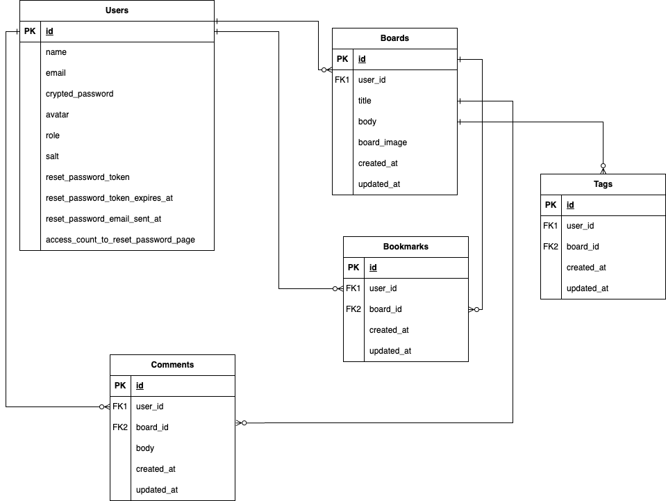

# graduation_exam

### サービス概要
1. 健康に関する質問やアドバイスを共有できる掲示板。
2. シンプルなUIで誰でも簡単に利用可能。

### このサービスへの思い・作りたい理由
このサービスは、健康管理に関心のある人たちが気軽に情報交換できる場を提供したいという思いから生まれました。自分自身が健康に関する情報を探していた際に、信頼できる情報源が分散しており、不便さを感じた経験があります。このアプリを通じて、健康に関する知識を共有し、お互いにサポートし合えるコミュニティを作りたいと考えました。

### ユーザー層について
**働く大人**：健康管理に関心が高く、同じ境遇の人々と情報を共有したいと考える人をターゲットとします。またシンプルなUIは、忙しい社会人に適していると考えました。

### サービスの利用イメージ
ユーザーは掲示板にアクセスし、健康に関する質問やアドバイスを投稿します。他のユーザーはそれに対してコメントをし、情報を交換します。検索機能を使って、過去の投稿や関連情報を簡単に見つけることができます。

### ユーザーの獲得について
**働く大人**：健康関連のブログやウェブサイトでの紹介、SNSでのプロモーション。

### サービスの差別化ポイント・推しポイント
- **既存の掲示板との差別化**：健康に特化した情報交換の場であり、特定のトピックに関する深い知識を持つコミュニティが形成されます。
こちらはMVPリリース後に、投稿に対して関連するタグを付けられるようにすることで、ユーザーが特定の興味や関心に基づいた情報を簡単に見つけられるようにします。

### 機能候補
- **MVPリリース時に作っていたい機能**
  - 基本的な掲示板機能（投稿、コメント、ブックマーク）
  - ユーザープロフィール機能
  - 検索機能
- **本リリースまでに作っていたい機能**
  - 各SNSへの共有機能：ユーザーが投稿内容を各種SNSに簡単に共有できる機能を追加し、コミュニティの外部との連携を強化します。
  - タグ付け機能：掲示板にタグ付けをできる機能を追加し、ユーザーが特定のトピックに関する知識を得られるようにします。

### 機能の実装方針予定
- **掲示板機能**：Railsの標準的なCRUD機能を活用し、基本的な投稿・コメント機能を実装します。
- **検索機能**：gem 'ransack'を使用して、ユーザーがキーワードを入力した際に関連する掲示板やブックマークが表示されるようにします。

### 使用予定の技術スタック
各SNSへの共有機能：ユーザーが投稿内容を各種SNSに簡単に共有できる機能を追加し、コミュニティの外部との連携を強化します。バックエンド：Ruby on Rails
- フロントエンド：HTML、CSS
- データベース：PostgreSQL
- デプロイ先：Heroku

### ER図
